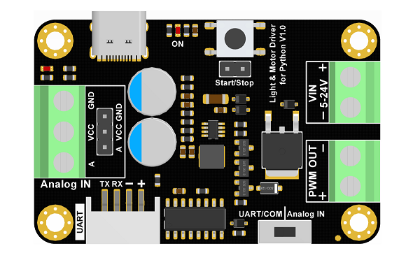

# DRI0050: Light&Motor Driver




---------------------------------------------------------

## Table of Contents

* [URL](#url)
* [Summary](#summary)
* [Blocks](#blocks)
* [License](#license)
* [Supported targets](#Supportedtargets)

## URL
* Project URL : ```https://github.com/liliang9693/ext-lightdriver```

* Tutorial URL : ```https://mindplus.dfrobot.com.cn/extensions-user```

    


## Summary
使用Mind+V1.7.1及以上版本用户库加载此扩展，通过USB控制DRI0050灯带电机驱动板。

## Blocks


## Examples


## License

MIT

## Supported targets

MCU                | JavaScript    | Arduino   | MicroPython    | Python 
------------------ | :----------: | :----------: | :---------: | -----
arduino        |             |              |             | 
micro:bit        |             |              |             | 
esp32        |             |              |             | 

## Release Logs

* V0.0.1  基础功能完成

